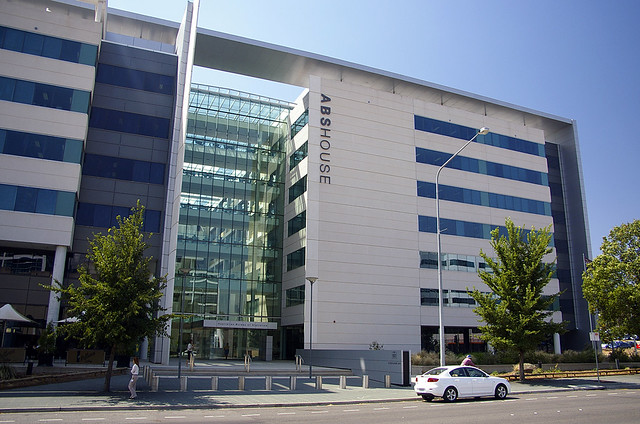

## Venue

ABS House is located at [45 Benjamin Way, Belconnen, Canberra, ACT 2617](https://maps.app.goo.gl/75UtffBe8zZ27KWS8).

The conference will be held in the Knibbs Lecture Theatre. The venue is wheelchair accessible, however if you have any questions or additional requirements, please get in touch with the conference chair [Ben Harrap](mailto:benjamin.harrap@anu.edu.au?subject=ADSN%20Conference%20accessibility)

### Driving

The conference venue is a 10-minute drive from the CBD or a 20-minute drive from the Canberra Airport.

There are many car parks nearby, including at the Westfield Shopping Centre.

<iframe src="https://www.google.com/maps/embed?pb=!1m16!1m12!1m3!1d3258.6292673979387!2d149.06548607525264!3d-35.240597774234956!2m3!1f0!2f0!3f0!3m2!1i1024!2i768!4f13.1!2m1!1sparking!5e0!3m2!1sen!2sau!4v1778331551199!5m2!1sen!2sau" width="600" height="450" style="border:0;" allowfullscreen loading="lazy" referrerpolicy="no-referrer-when-downgrade">

</iframe>

### Public transport

If you're staying in the Canberra CBD area, you can catch routes 2, 3, 4, 5, and 6 from Alinga Street to the Belconnen Bus Interchange. ABS House is just around the corner. To use public transport in Canberra you can simply tap on with a Visa or Mastercard card or use a MyWay+ card or the app.

### Other travel

E-bikes and e-scooters are available through Lime Micromobility, but we wouldn't recommend scooting from the CBD!

## Accommodation

There are many accommodation options, both in Belconnen near the conference venue, and in the Canberra CBD.

We have arranged discounted accommodation for conference attendees at the following hotels:

### Mercure Canberra Belconnen

Delegates are eligible for a discounted nightly rate of $185:

- Booking link: <https://all.accor.com/hotel/B390/index.en.shtml>
- Booking code: BGPG