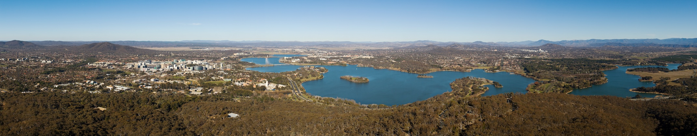
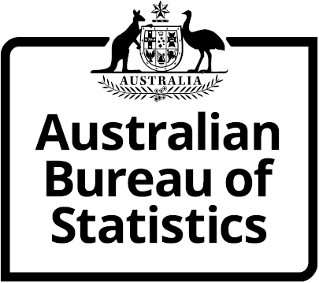
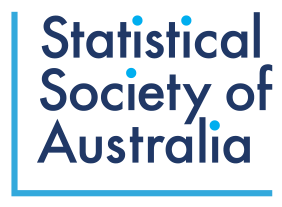

::: {.column-screen style="font-size: 0.7em; color: #adadad;"}
{style="min-width: 100%;"} Copyright [JJ Harrison](https://www.jjharrison.com.au/){style="color: #adadad;"}
:::

Join us in the nation's capital for the annual Australian Data Science Network Conference. This year's theme is *From Data to Decisions*, which focuses on impactful data science that informs decisions, changes minds, and shapes policy.

## Sponsors

{.sponsor-logo}
{.sponsor-logo}

Want to find out more about sponsoring the conference? Head over to the [sponsorship page](/sponsors.qmd).

## Key information

-   Abstract submissions will close Friday 24th July, with results announced in September
-   The conference will be held over the 26th & 27th of November, at ABS House in Belconnen, Canberra
-   Both days will be a single stream
-   Social program to be announced
