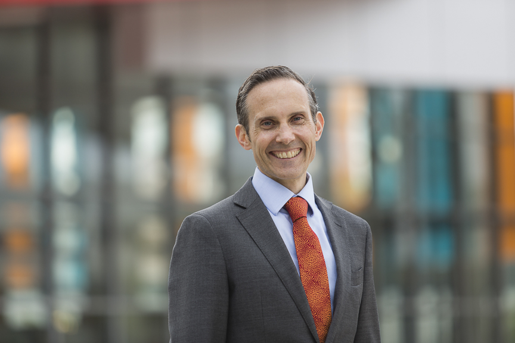

Stay tuned for program announcements! Follow the [ADSN on LinkedIn](https://www.linkedin.com/company/australiandata/) or [subscribe to the newsletter](https://australiandatascience.net/subscribe-to-newsletter/).

## Keynotes

### Andrew Leigh MP 

::: {.columns}
:::: {.column width=55%}
[Andrew Leigh](https://www.andrewleigh.com/andrew) is the Assistant Minister for Productivity, Competition, Charities and Treasury, and Federal Member for Fenner in the ACT. Prior to being elected in 2010, Andrew was a professor of economics at the Australian National University. He holds a PhD in Public Policy from Harvard, having graduated from the University of Sydney with first class honours in Arts and Law. Andrew is a past recipient of the Economic Society of Australia's Young Economist Award and a Fellow of the Australian Academy of Social Sciences.
::::
:::: {.column width=5%}
::::
:::: {.column width=40%}

::::

<!-- ## Program -->

