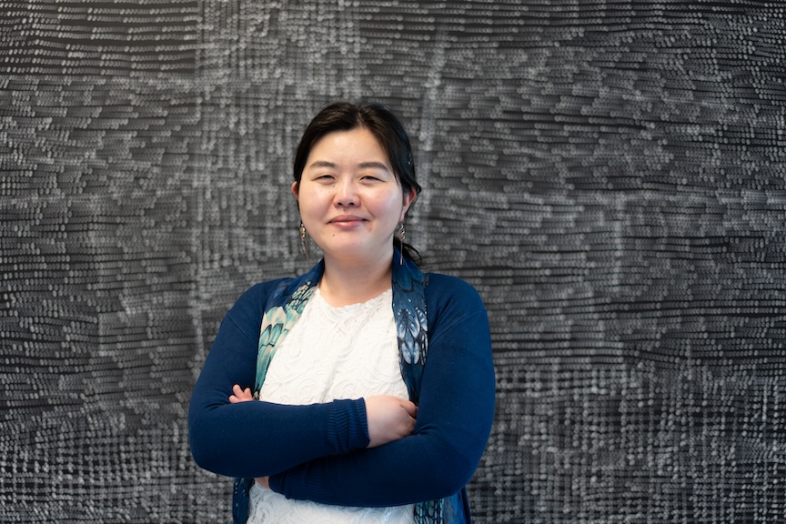

Stay tuned for program announcements! Follow the [ADSN on LinkedIn](https://www.linkedin.com/company/australiandata/) or [subscribe to the newsletter](https://australiandatascience.net/subscribe-to-newsletter/).

## Keynotes

### Dr Emi Tanaka, Australian National University

::::: {.columns}
:::: {.column width=55%}

[Emi Tanaka](https://emitanaka.org/) is a statistician, the Australian National University lead for the [Analytics for The Australian Grains Industry Project](https://anu-aagi.github.io/), and Editor-in-Chief of the R Journal. She has a passion for data science and open-source software, which is evident across her work spanning experimental design, mixed-effects models, data visualisation, emerging analytics (machine/deep learning and large language models) and developing better statistical workflows, practice and tools. 

Since completing her PhD in statistics in 2015, Emi has been recognised as an expert and leader in her field, delivering numerous invited talks both nationally and internationally and being awarded the Statistical Society of Australia President's Award for Leadership in Statistics.

::::
:::: {.column width=5%}
::::
:::: {.column width=40%}
{fig-alt="A photo of Emi Tanaka, standing in front of a large white-and-black artwork, arms folded and smiling at the camera"}
::::
:::::

#### **Decision-Making with Statistics and Data Science in the Age of AI**

Artificial intelligence (AI) is emerging as one of the most significant technological disruptors of contemporary society. It is changing almost every aspect of our lives: how we generate and discuss ideas, gather and process information, automate workflows, write code, solve mathematical problems, and ultimately make decisions.
 
In this talk, I will present some emerging uses of AI in statistics and data science. I will also reflect on trends I am increasingly seeing as the Editor-in-Chief of the R Journal, which publishes research centred on R, one of the most widely used programming languages for statistics and data science. From this perspective, I have witnessed first-hand how AI is changing journal article writing, R package development, peer review, and copy-editing.
 
I will discuss both the risks and opportunities that AI brings. As a society, we need to recognise and embrace the distinctive value that humans bring to the table, while adapting to new ways of working, reasoning, and making decisions alongside AI.

&nbsp;

### Andrew Leigh MP

::::: {.columns}
:::: {.column width=55%}

[Andrew Leigh](https://www.andrewleigh.com/andrew) is the Assistant Minister for Productivity, Competition, Charities and Treasury, and Federal Member for Fenner in the ACT. Prior to being elected in 2010, Andrew was a professor of economics at the Australian National University.

He holds a PhD in Public Policy from Harvard, having graduated from the University of Sydney with first class honours in Arts and Law. Andrew is a past recipient of the Economic Society of Australia's Young Economist Award and a Fellow of the Australian Academy of Social Sciences.

::::
:::: {.column width=5%}
::::
:::: {.column width=40%}
{fig-alt="A photo of Andrew Leigh MP, wearing a suit and tie, smiling at the camera"}
::::
:::::

#### **The Microdata Dividend**

At a time when survey response rates are falling globally, the Australian Bureau of Statistics has invested heavily in confidentialised microdata for research. Operated under strict privacy protections and in secure data environments, the Person-Level Integrated Data Asset (PLIDA) and the Business Longitudinal Analytical Data Environment (BLADE) sit alongside other assets such as the Australian Census Longitudinal Dataset, the Longitudinally Linked Employer-Employee Database, the Australian Census and Migrants Integrated Dataset and the Vocational Education and Training National Data Asset. 

These datasets allow researchers to follow people and firms over time and study policy effects at scale. They enable randomised trials to track outcomes through administrative records and nonprofits to evaluate client outcomes. Already, linked microdata has informed government policies, including merger reform and the decision to ban non-compete clauses for low- and middle-income workers. This talk looks at what Australia’s expanding microdata infrastructure offers researchers, how these assets are being used by international experts, the role of the APS Data Profession, and where the next gains might come from.

## Social program

### Pre-conference informal gathering

:::: {.columns}
::: {.column width=55%}
🗓️ Wednesday 25th November, 6pm onward

📍 The Lighthouse Pub, Belconnen

For those looking for something to do the night before the conference starts, we've booked the beer garden at the The Lighthouse Pub. Come November the weather should be perfect to enjoy dinner whilst looking out over Lake Ginninderra.

Note that we've booked the space only. While attendees will be responsible for their own food and drink expenses, the conversation will be free!
:::
::: {.column width=5%}
:::
::: {.column width=40%}
{fig-alt="A photo of the Lighthouse Pub's beer garden. A decked area with seating shaded by trees, overlooking Lake Ginninderra"}
:::
::::

### Conference social night

:::: {.columns}
::: {.column width=55%}
🗓️ Thursday 26th November, 6pm to 9pm

📍 Generator Gallery, Belconnen Arts Centre

Come along for a night of conversation, contemporary art, and stunning views over Lake Ginninderra. This catered event is an opportunity for attendees to relax and get to know one another.

All conference attendees are welcome at the social night, with tickets included in the price of registration.
:::
::: {.column width=5%}
:::
::: {.column width=40%}
{fig-alt="A photo of the Generator Gallery, a large open-plan space with art displayed on walls and stands, gallery lighting, and floor to ceiling windows that look out over Lake Ginninderra"}
:::
::::